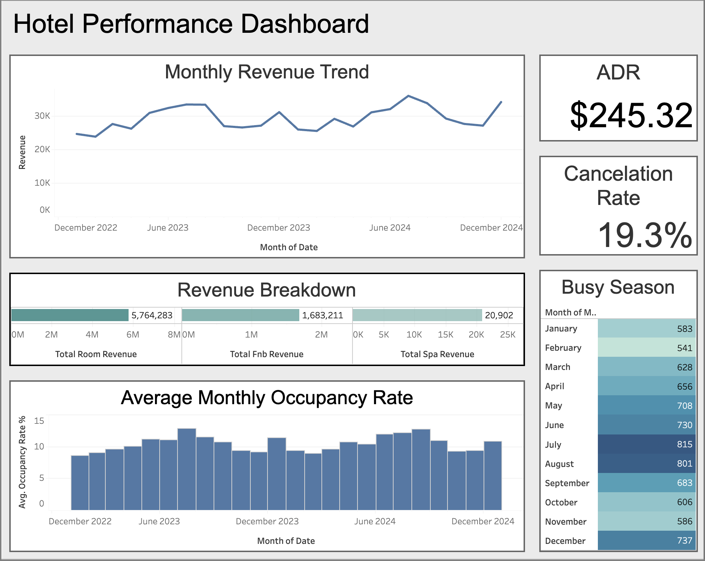

# Hotel Performance Analysis (2023–2024)

**Author:** Angel Macedo  
**Date:** October 17, 2025  
**Tools:** Python | MySQL | Tableau  
**Dashboard:** [View Interactive Dashboard](https://public.tableau.com/app/profile/angel.macedo/viz/AngelMacedo/Dashboard1)

---

## Overview
This project analyzes two years of hotel operational and financial data (2023–2024) to evaluate revenue trends, occupancy performance, and booking behavior.  
Using **SQL** for data extraction, **Python** for cleaning, and **Tableau** for visualization, I developed a comprehensive reporting workflow similar to what reporting analysts and revenue managers use in the hospitality industry.

---

## Key Insights
- **Total Revenue:** $7.47 million  
- **Average Daily Rate (ADR):** $245.32  
- **Cancellation Rate:** 19.26% (≈ $1.78M in lost revenue)  
- **Main Revenue Source:** Room revenue (77% of total)  
- **Peak Months:** July & August  
- **Off-Peak Months:** January & February  
- **Average Length of Stay:** 3.9 days  

---

## Summary of Findings
- The hotel shows **strong revenue growth** year-over-year and a healthy ADR.  
- **Clear seasonal peaks** occur in summer, while early winter is the slowest period.  
- **High cancellation rates** are a major issue, costing over $1.7M in potential revenue.  
- **F&B services** perform well but **spa revenue remains underdeveloped**, offering potential for growth.  

---

## Recommendations
1. Implement stricter or tiered **cancellation policies** during peak seasons.  
2. Launch **targeted promotions** to increase off-season bookings.  
3. Expand and market **spa and F&B packages** to grow ancillary revenue.  
4. Continue using **dynamic pricing** to optimize RevPAR and resource allocation.  

---

## Project Workflow
1. **Data Extraction (MySQL):** Revenue, booking, and occupancy data collected using SQL queries.  
2. **Data Cleaning (Python):** Handled missing values, standardized dates, and validated revenue totals.  
3. **Data Visualization (Tableau):** Interactive dashboard created for management reporting.

---

## Files in This Repository
- `hotel_reporting.sql` – SQL script used to extract and prepare data.  
- `Hotel_Performance_Report.pdf` – Full detailed report.  
- `README.md` – Project summary and documentation.  

---

## Dashboard Preview
  
*(This image provides a quick preview of the interactive Tableau dashboard.)*

---

## About Me
I’m **Angel Macedo**, a data analyst with experience in financial reporting, business analytics, and performance tracking.  
I specialize in turning complex data into actionable insights that help companies improve efficiency and revenue performance.  

- 📍 Based in Chapel Hill, NC  
- 💼 [LinkedIn](https://linkedin.com/in/angelr-macedo)  
- 💻 [GitHub](https://github.com/angelrmacedo1)  
- 🌐 [Portfolio Website](https://angel-macedo-data-analyst-portfolio.lovable.app)

---

